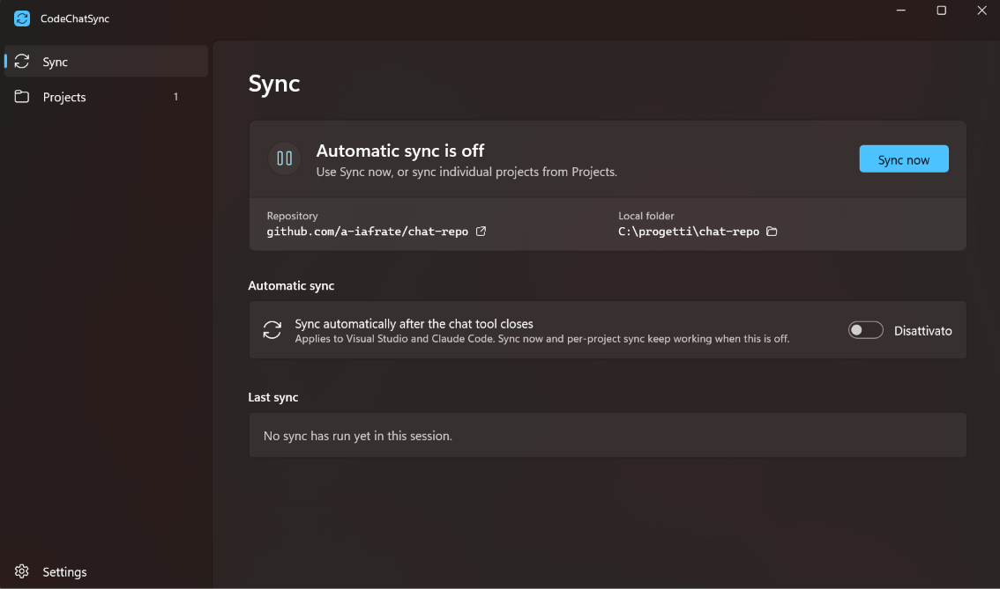
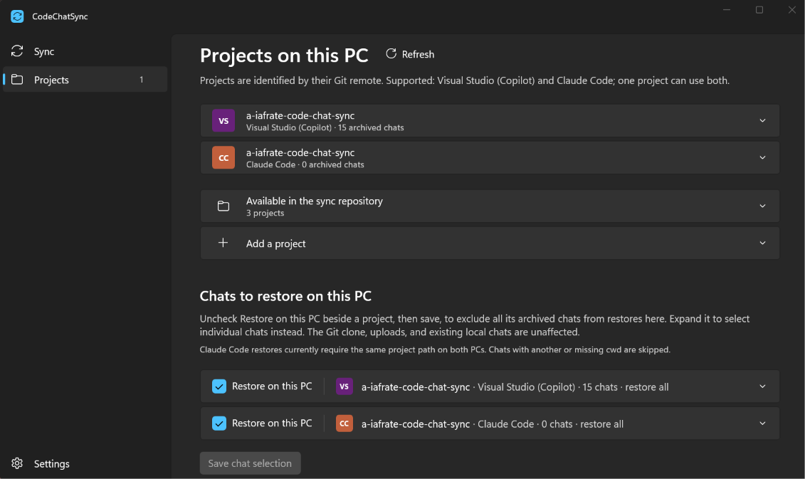
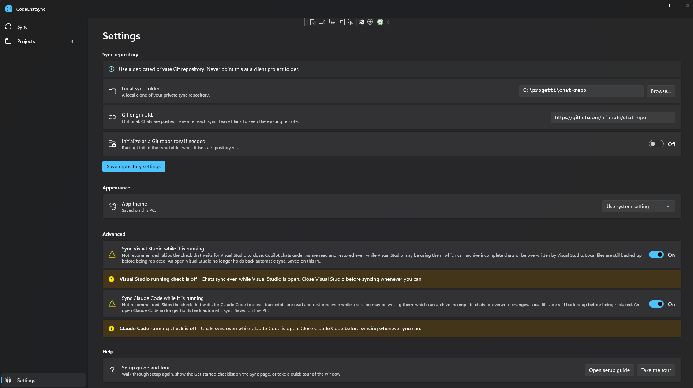

# CodeChatSync

Syncs AI chats (Visual Studio Copilot and Claude Code) across the user's PCs,
keeping them **out of client Git repos**. Personal prompts are planned.

> Status: Phases 0–3 are complete; Phase 4 (the configuration window) is in
> progress. See [`docs/ROADMAP.md`](docs/ROADMAP.md) for current progress.

## Quick start (CLI)

```powershell
# Point the tool at your private sync repository
# (add --init to create the repository if the folder is not one yet)
codechatsync config set-sync-root C:\path\to\your\sync-repo

# Register a project, identified by its Git remote
codechatsync add C:\path\to\your\project --name client-erp

# See what would be copied, then do it
codechatsync sync --dry-run
codechatsync sync
```

`codechatsync discover` lists Visual Studio chats found on this PC without
copying anything. Provider-owned chats are accessed only while the relevant
provider is closed, and every existing local file is backed up before overwrite.
The CLI `add` command registers Visual Studio; add Claude Code projects from
the tray app's Claude project list.

`sync` pulls the sync repository, copies the chats, then commits and pushes,
using the `git` you already have installed so your existing credential helper
and SSH keys keep working. Add `--no-git` to copy files only. Pulls are
fast-forward only: if the same chat changed on two PCs, the run stops and
leaves both sides untouched instead of merging two transcripts. A sync never
copies chats before the pull succeeds when the sync folder is a Git repository
with a remote: on a new PC whose branch was never pushed, the remote branch is
fetched and pulled first; if Git is missing or the remote cannot be reached,
the run stops. The sync repository is also set up to store every chat exactly
as written (`.gitattributes` with `core.autocrlf` off), so a PC with a
different line-ending setting never turns into a false conflict on a file
nobody actually changed.

## Tray app

`CodeChatSync.App` runs in the notification area and syncs on its own once
Visual Studio has been closed for long enough that its chat files have
settled. Its menu shows the current status and offers *Sync now*, a status
window, *Start with Windows*, and *Exit*. It only interrupts you when a run
needs attention, such as a conflict or a pull that could not be completed.

| Sync | Projects | Settings |
| --- | --- | --- |
|  |  |  |

The window opened from the tray has three pages in a left navigation pane:
**Sync** (status, *Sync now*, repository and folder summary with buttons to
open the repository in the browser and the folder in File Explorer, automatic sync,
last run), **Projects** (registered projects, adding projects, and chats to
restore on this PC), and **Settings** (sync repository, appearance, advanced
options, and help).

On the first launch the window opens by itself with a short **setup guide**:
it walks through choosing the sync repository, adding projects, and running
the first sync. A **Get started** checklist on the *Sync* page tracks what is
left, and each step can point you to the right control. *Settings > Help*
reopens the guide or a quick tour of the window at any time.

Under *Settings*, choose a **separate private sync folder** and
optionally set its Git `origin` URL.
*Initialize as a Git repository if needed* to create one in a new folder.
A blank URL leaves an existing remote unchanged. The window reports errors
without saving a failed configuration change.

On the *Projects* page, expand *Add a project*, pick the *Visual Studio (Copilot)*
provider, and choose a folder inside a project's Git repository. If none is
detected, enter one under *Advanced options*. A project already registered
from another PC shows up under *Available in the sync repository* (collapsed
by default): expand it and use *Browse and add…* next to one to register it
here by its local folder, without retyping its remote. Registered projects
are collapsed by default too; expand one to see its provider, remote, local
folder and last sync run, sync just that project, or remove its registration
on this PC. To add Claude Code, pick the *Claude Code* provider under *Add a
project*, choose *Find Claude Code projects*, and select a Git repository
discovered from `%USERPROFILE%\.claude\projects` (or
`$CLAUDE_CONFIG_DIR\projects`); sessions started in any of its subfolders are
included automatically, since Claude Code stores each separately. Claude
candidates need a Git remote on the repository root; the same remote may have
both providers, displayed separately. Removing a registration does **not**
delete local or archived chats. `codechatsync add` remains available for
Visual Studio in the CLI.

A Visual Studio chat restored from another PC now shows up in Visual Studio's
own Chat History panel too, not just on disk: alongside the transcript,
CodeChatSync keeps in sync the per-solution entry Visual Studio reads
(`.vs/<solution>/copilot-chat/...`), rebuilding it from the transcript when
the source PC never had one of its own — for example when the chat was
started with the repository open as a plain folder rather than as a solution.
This is the one narrow, deliberate exception to never writing inside a client
repository; see [`docs/ARCHITECTURE.md`](docs/ARCHITECTURE.md). Continuing a
restored chat on another PC updates that entry the next time each side syncs,
without duplicating it.

On the *Sync* page, turn off *Automatic sync* to stop syncing automatically
after the chat tools close on this PC; the change is saved immediately and
defaults to on, including for existing installations. *Sync now* and
per-project sync remain available either way.

Under *Settings* > *Appearance*, choose *Use system setting*, *Light*, or *Dark*;
the window theme changes and is saved immediately on this PC. Existing installations
follow the Windows setting by default; the native tray menu follows Windows independently.

Under *Chats to restore on this PC*, uncheck a provider's collapsed project
and save to prevent all its archived chats from being restored on this machine.
Expand a project to select individual chats;
the searchable list shows short titles, dates and session IDs. By default all
current and future sessions are restored. Uncheck *Restore all chats* to choose
a subset and save: future chats are excluded until selected. Re-enabling a
project with no saved selection starts with restore all. The full Git clone
remains available for backup; a different PC can select a different subset.
These choices do not stop uploads from registered projects and do **not** delete
existing local chats or anything from the repository.

**Claude Code limitation:** only top-level `<session-id>.jsonl` transcripts
are archived; memory and subagent artifacts are excluded. A session started
in a project subfolder (for example running Claude Code from `src`) is
archived under that subfolder's path and restored to the matching folder on
this PC, since Claude Code stores it separately from a session started at the
repository root. A transcript's absolute path is not confined to `cwd` — it
turns up in tool parameters and in free text too, and `cwd` itself tracks the
shell's current directory rather than staying fixed — so restoring now
rewrites every occurrence to this PC's own project path, letting a chat
restore onto a PC where the project lives somewhere else entirely. A chat
archived before this existed still restores only where the path already
matches, until a PC syncs it again. What has **not** been confirmed yet is
whether Claude Code itself correctly lists and resumes a chat rewritten this
way — verified so far against real transcript files and the sync pipeline
itself, not against the Claude Code app. Only processes named `claude` are
currently detected; Claude launched through a differently named host such as
`node` may not be detected, so close all Claude processes before using Claude
discovery or sync.

By default, a sync never touches a tool's chat files while that tool is
running (Visual Studio chats are left alone; Claude Code discovery and sync are
refused). *Settings > Advanced* offers two per-PC opt-outs, off by default and
confirmed before enabling: *Sync Visual Studio while it is running* and *Sync
Claude Code while it is running*. They apply to *Sync now* (window and tray),
per-project sync, automatic sync, and Claude project discovery: chats are then read and restored even while the
tool may be writing them, which can archive an incomplete chat or lose changes
to a restored one. Local files are still backed up before being replaced.
A skipped tool no longer holds back automatic sync (for example when Visual
Studio closes while Claude Code is open), but a skipped tool that stays open
does not trigger a sync by itself: use *Sync now*.
The CLI `sync` command honors the same settings.

## Why

Anyone working across multiple client projects, in separate repos, on
several PCs, ends up with Copilot chats tied to a single machine: locked
inside `.vs`, unreachable elsewhere. CodeChatSync carries them along,
without touching client repos and without relying on third-party cloud
services.

## How it works, in short

- Chats are **copied** (never symlinked) between the project's local folder
  and a sync folder, which is itself a **private Git repo owned by the
  user**.
- Each project is identified by its **Git remote**, not by its disk path:
  the same solution can live in different folders on different PCs.
- Syncing happens **manually** or **automatically when Visual Studio
  closes**.
- A tray app (**WinUI 3**, Windows-only) handles configuration, syncing,
  and auto-start; a lightweight CLI stays available for terminal or script
  use.

Full details in [`docs/ARCHITECTURE.md`](docs/ARCHITECTURE.md).

## Solution structure

```
CodeChatSync.Core                      # config, provider registry, merge/conflict logic
CodeChatSync.Providers.VisualStudio    # discover/map for Visual Studio Copilot chats
CodeChatSync.Providers.Claude          # Claude Code transcript discovery and mapping
CodeChatSync.Git
CodeChatSync.Cli                       # lightweight CLI: add, sync, discover
CodeChatSync.App                       # WinUI 3 app: tray, integrated watch, configuration
```

## Planned features

- Syncing Copilot chats (Visual Studio) across PCs
- **Chat Library** — view and edit synced chats, including the title shown
  in Visual Studio's Chat History panel
- **Prompt Library** — a personal library of prompt files (`.prompt.md`),
  synced across PCs, with explicit deployment into individual client repos
  (the only case where the tool writes inside a client repo, required by
  how Visual Studio reads prompt files)
- Future providers for other AI tools (Copilot CLI)

Full roadmap, with phase order, in
[`docs/ROADMAP.md`](docs/ROADMAP.md).

## Documents for AI assistants

- [`CLAUDE.md`](CLAUDE.md) — project instructions for Claude
- [`.github/copilot-instructions.md`](.github/copilot-instructions.md) —
  repo instructions for GitHub Copilot

Both point to `docs/ARCHITECTURE.md` and `docs/ROADMAP.md` instead of
duplicating their content.

## Language

All documentation, code, identifiers, and comments are in **English**,
regardless of the language used when discussing the project with an AI
assistant.

## Requirements

**.NET 10** on every project (pinned via `global.json`), Windows for
`CodeChatSync.App` (WinUI 3, latest stable Windows App SDK).
`CodeChatSync.Core`, both provider projects, and `CodeChatSync.Git` stay
platform-agnostic libraries.

## License

Personal project, private use. No public license defined at this time.
